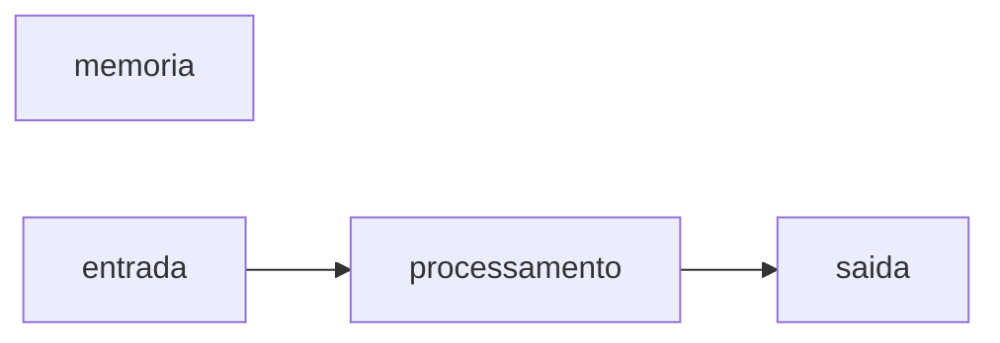

# JavaScript
repositorio usado para estudo da logica de programação com uso de linguagem javascript
## Autor
Isaac

---
## variaveis
variaveis são espaços na memoria do computador usados para guardar valores que podem alterar no longo do programa
### principais tipos primitivos:
- string (texto)
- number (numeros inteiros e nao inteiros)
- boolean (verdadeiro ou falso)

## operadores aritmeticos
| operador | proposito | exemplo | resultado |
|----------|-----------|---------|-----------|
| = | atribuir um valor | x = 10 | x = 10|
| + | somar | 10 + 5 | 15 |
| += | somar e atribuir | x += 5 | x= 15 |
| - | subtrair | 15 - 10 | 5 |
| -= | subtrair e atribuir | x -= 10 | x = 5 |
| * | multiplicar | 5 * 4 | 20 |
| *= | multiplicar e atrtibuir | x *= 4 | x = 20 |
| / | dividir | 20 / 2 | 10 | 
| /= | dividir e atribuir | x /= 2 | 10 |
| ++ | somar 1 no resultado | x++ | 11 |
| -- | subtrair 1 do resultado | x-- | 10 |
| % | resto da divisao | 10 % 3 | 1 | 

## operadores logicos

| operador | simbologia |
|----------|------------|
| AND | && |
| OR | \|\| |
| NOT | ! |

## Comparadores 
| operador | significado |
|----------|-------------|
| > | Maior que |
| >= | Maior ou igual a |
| < | Menor que |
| <= | Menor ou igual que |
| === | Identico a |
| !== | Não identificado  |

###Estrutura de controle
###Estrutura de controle condiucionais

```javascript
if (condição) {
 //condição verdadeira
}

if (condição)(
  //condiçao verdadeira
  
} else {
  //condiçao falsa
}

if (condição 1) {
 //condição 1 verdadeira
} else if (condição 2)
 //condição 2 verdadeira
} else {
 //se nenhuma das condições anteriores for verdadeira
}

switch (valor)
 case 1:
  //codigo caso o valor seja 1
  break
deafult:
  //codigo caso o valor seja diferente de 1 ou 2
  break

--------------------------------------------------
### laços de repetiçoes
 ````javascript
 for (let = 1), 1 < 10; i++ (
 // o codigo é repetido enquanto a condiçao for verdadeiras
}

wrile (condiçao) {
 // o codigo repetido enquanto a condiçao for verdadeira
}

do {
 // o codigo é executado uma vez idepedente da condiçao; depois
 // o codigo é repetido enqyanto a condiçao for verdadeira
} while

```

